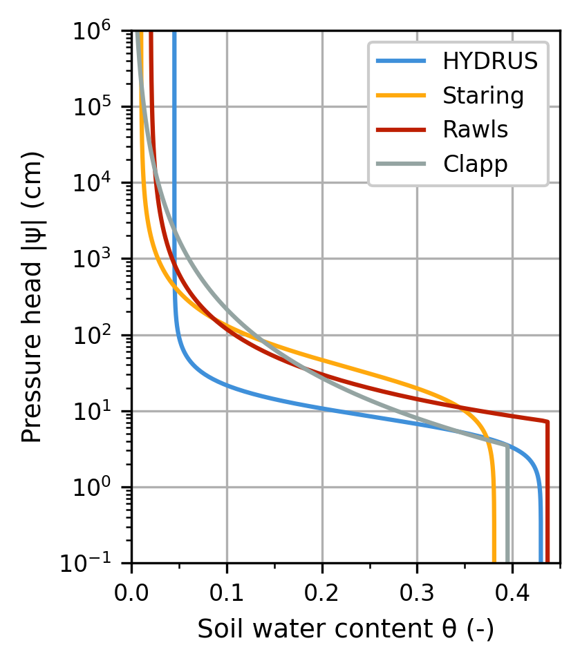
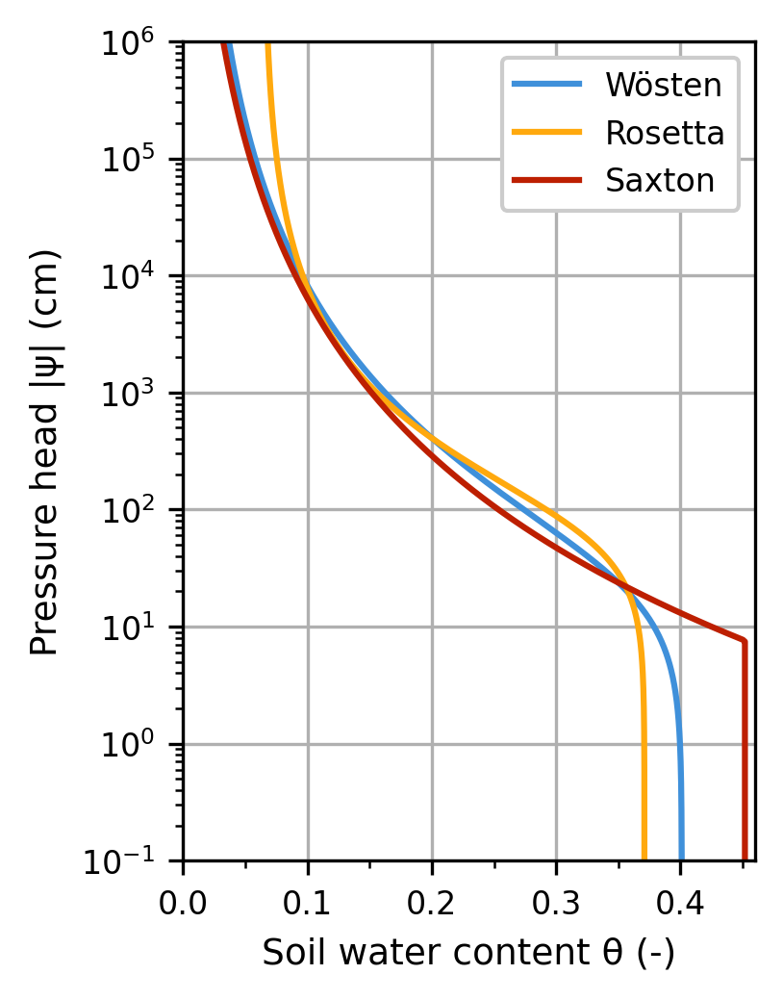
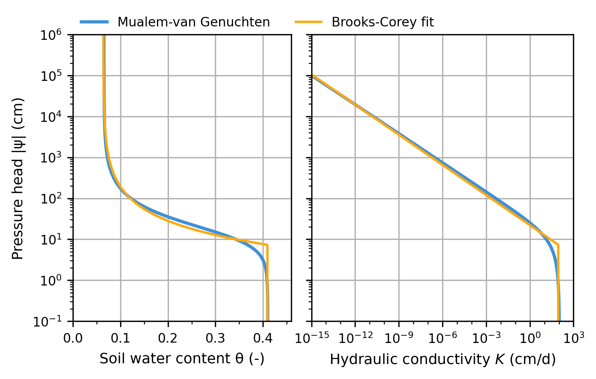

# Summary
`pedon` is a Python package for describing and analyzing unsaturated soil hydraulic properties. It provides an object-oriented framework for soil hydraulic models, along with tools for retrieving parameters from soil parameter databases, applying pedotransfer functions, and fitting soil hydraulic model parameters to measurements.

# Statement of need
Researchers and engineers working with unsaturated soils need estimates of soil hydraulic model parameters for groundwater models. `pedon` provides a Python toolkit that brings together soil hydraulic models, parameter databases, pedotransfer functions, and fitting routines, making soil analysis faster, more reproducible, and easier to integrate into existing groundwater modeling workflows.

# Soil hydraulic models
A soil hydraulic model (or soil model for short) is a parametric description of soil hydraulic functions: the soil water retention curve (SWRC) and the unsaturated hydraulic conductivity function (HCF). These relate soil water content and flow to pressure head and vice versa for use in variably saturated groundwater flow models. At this time, `pedon` provides the following soil models:

- `pedon.Genuchten`: Mualem-van Genuchten [@mualem_model_1976; @genuchten_mualem_1980]
- `pedon.Brooks`: Brooks-Corey [@brooks_corey_1964]
- `pedon.Panday`: van Genuchten SWRC and Brooks-Corey HCF [@fuentes_burdine_1992; @panday_mfusgt_2026]
- `pedon.Fredlund`: Fredlund-Xing [@fredlund_xing_1994]
- `pedon.Haverkamp`: Haverkamp [@haverkamp_model_1977]
- `pedon.Kosugi`: Kosugi [@kosugi_model_1996]
- `pedon.Campbell`: Campbell [@campbell_model_1974]
- `pedon.Gardner`: Gardner(-Kozeny) [@gardner_model_1958; @brutsaert_kozeny_1967; @bakker_gardner_2009; @mathias_gardner_2006]
- `pedon.Rucker`: van Genuchten-like SWRC and Gardner HCF [@rucker_gardner_2005]
- `pedon.GenuchtenGardner`: van Genuchten SWRC and Gardner HCF [@genuchten_mualem_1980; @gardner_model_1958]
- `pedon.Kool`: Mualem-van Genuchten SWRC and HCF with hysteresis in SWRC [@kool_parker_1987]

## Software design
The soil models are implemented as Python classes with model-specific methods for evaluating the SWRC and HCF. For example, the Mualem–van Genuchten soil model can be used as follows:

```python
import numpy as np
import pedon as pe

# Mualem-van Genuchten parameters for Sandy Loam
mg = pe.Genuchten(
    k_s=106.1,  # saturated conductivity (cm/d)
    theta_r=0.065,  # residual water content (-)
    theta_s=0.41,  # saturated water content (-)
    alpha=0.075,  # shape parameter (1/cm)
    n=1.89,  # shape parameter (-)
)

h = np.logspace(-1, 4, 6)  # pressure head (cm)
theta = mg.theta(h)  # water content (-) at pressure head values
k = mg.k(h)  # hydraulic conductivity (cm/d) at pressure head values
```

The object-oriented design and duck typing (relying on object methods rather than explicit types) provide a clear and consistent structure in which users can define custom soil model classes. Additionally, `pedon` only depends on well-maintained packages in the Python scientific ecosystem such as NumPy [@numpy_article_2020], SciPy [@scipy_paper_2020], Matplotlib [@matplotlib_paper_2007], and Pandas [@pandas_software_2020; @pandas_paper_2010].

# Soil hydraulic parameters
Soil hydraulic parameters determine the shape of a soil model’s SWRC and HCF, but are rarely measured directly. To address this, pedon links these parameters to soil models by providing a unified framework to derive them from reference datasets, empirical relationships, or direct (laboratory) measurements.

## Parameter datasets
`pedon` includes a large dataset of soil model parameters for a wide range of soils, currently compiled from the following sources:

- HYDRUS [@carsel_dataset_1988; @simunek_hydrus_2008] and the Staring series [@wosten_staringreeks_2001; @heinen_staringreeks_2020; @heinen_bofek_2022] for Mualem–van Genuchten parameters. HYDRUS provides standard averages across twelve major soil textural groups, while the Staring series derives its values from hundreds of processed Dutch soil samples.
- VS2D [@healy_vs2d_1990] and @rawls_dataset_1982 for Brooks–Corey parameters.
- @clapp_hornberger_1978 for Campbell parameters.

For example, a parameter set for a sandy soil (classified as "B05" in the Staring series) can easily be obtained from any of the databases via the following code, enabling direct comparison of the resulting SWRC's (Figure \ref{fig:dataset_swrc}).

```python
hydrus = pe.Soil("Sand").from_name(pe.Genuchten, source="HYDRUS")
staring = pe.Soil("B05").from_name(pe.Genuchten, source="Staring_2018")
rawls = pe.Soil("Sand").from_name(pe.Brooks, source="Rawls")
clapp = pe.Soil("Sand").from_name(pe.Campbell, source="Clapp")
```



## Parameter estimation
`pedon` provides two approaches for obtaining soil model parameters from soil measurements. The first uses pedotransfer functions based on easily measured soil properties. The second relies on direct measurements of soil water content and hydraulic conductivity.

### Pedotransfer functions
Pedotransfer functions relate easily measured soil properties (e.g. sand, silt, clay or organic matter content and bulk density) to soil model parameters [@bouma_pedotransfer_1989; @looy_pedotransfer_2017]. `pedon` implements a comprehensive suite of pedotransfer functions from the literature, including those of @cosby_pedotransfer_1984, @cooper_pedotransfer_2021, @saxton_pedotransfer_1986, @saxton_pedotransfer_2006, @rawls_pedotransfer_1989, @vereecken_pedotransfer_1989,  @vereecken_pedotransfer_1990, @wosten_pedotransfer_1999, Rosetta [@schaap_rosetta_2001; @zhang_rosetta3_2017], @wosten_staringreeks_2001, @hodnett_pedotransfer_2002, @weynants_pedotransfer_2009, @toth_pedotransfer_2015. The code snippet below shows how to apply three different pedotransfer functions to the same soil sample, resulting in different parameter estimates and thus SWRCs' (Figure \ref{fig:ptf_swrc}).

```python
# Create a soil sample with easily measured properties. Note that
# not all pedotransfer functions require all of these properties,
# but this is a common set that covers most cases.
ss = pe.SoilSample(
    sand_p=60.0,  # sand (%)
    silt_p=30.0,  # silt (%)
    clay_p=10.0,  # clay (%)
    om_p=2.5,  # organic matter (%)
    rho=1.5,  # bulk density (g/cm3)
)

# Estimate van Genuchten parameters using Wösten (HYPRES)
wosten: pe.Genuchten = ss.wosten()

# Estimate van Genuchten parameters using Rosetta v3
# Optional dependency requiring installation of `httpx`
rosetta: pe.Genuchten = ss.rosetta(version=3)

# Estimate Brooks-Corey parameters using Saxton
saxton: pe.Brooks = ss.saxton()
```



Furthermore, `pedon` provides access to specialized tools such as HYPAGS [@peche_hypags_2023; @peche_genuchten_2024] which enables parameter estimation from a single value of saturated hydraulic conductivity or representative grain diameters.

```python
# Estimate parameters using HYPAGS
ks = 1e-3  # saturated hydraulic conductivity (m/s)
hypags: pe.Genuchten = pe.SoilSample(k=ks).hypags()
```

### Soil hydraulic measurements
`pedon` can estimate soil model parameters directly when measurements of soil water retention and/or unsaturated hydraulic conductivity are available. A soil model, together with its SWRC and HCF, is fitted to the data by minimizing the difference between measured and simulated values. This uses a nonlinear least-squares algorithm from SciPy [@scipy_paper_2020] and follows the well-established methodology of the RETC software [@genuchten_retc_1991].

### Soil model conversion
The same fitting procedure can translate between soil models. The SWRC and HCF generated by one model are sampled over a range of pressure heads and refitted using another formulation. This enables direct model comparison (Figure \ref{fig:fit_swrc_hcf}) and facilitates integration with external tools when a different soil model is required [@vonk_nonlinear_2024].

```python
# Fitting a Brooks-Corey soil model to existing Mualem-van Genuchten soil model
bc = pe.SoilSample(h=h, theta=theta, k=k).fit(pe.Brooks)
```



# State of the field
`pedon` contributes to the field of groundwater modeling by providing a modular, object-oriented framework that integrates hydraulic soil models, established parameter databases, and pedotransfer functions into a single, reproducible workflow. Existing tools such as unsatfit [@seki_unsatfit_2023], PySWR [@memari_pyswr_2021], and RETC [@genuchten_retc_1991] are utilities primarily focused on least-squares fitting of predefined soil models. In contrast, `pedon` enables researchers to define custom soil model formulations and systematically evaluate them against different datasets and pedotransfer functions. This level of interoperability is unique and provides a broader framework for the analysis of unsaturated soil hydraulic properties. At the same time, `pedon` is developed with a collaborative mindset, exemplified by the integration and extension of the soil model parameter estimation algorithms from HYPAGS [@peche_hypags_2023; @peche_genuchten_2024].

# Research impact statement
Soil hydraulic models and their parameters are essential for simulating variably saturated groundwater flow [@vereecken_modeling_2016]. Determining these parameters experimentally is difficult and time-consuming [@genuchten_retc_1991], and their resulting uncertainty can strongly impact model predictions [@baroni_uncertainty_2010; @brandhorst_uncertainty_2017]. Therefore, soil hydraulic model parameters are often approximated or estimated from reference parameter databases. `pedon` bundles soil models and parameter sources in a single framework, enabling efficient parameter derivation without extensive literature searches or ad hoc reimplementation. `pedon` is already used in scientific workflows for groundwater modeling, including published studies by @vonk_nonlinear_2024 and @collenteur_signatures_2025. Here, `pedon` can easily facilitate coupling to MODFLOW 6 [@langevin_modflow6_2017] and MODFLOW-USG Transport [@panday_mfusgt_2026] via Python [@bakker_flopy_2016; @hughes_flopy_2024]. Additionally, `pedon` was used by @brink_swap_2026 to process Dutch soil datasets [@heinen_bofek_2022].

# AI usage disclosure
GitHub Copilot was used during software development for reviewing pull requests, writing unit tests and documentation, providing code completion, and sanity-checking proposed bug fixes. ChatGPT and Gemini were used for this manuscript to review references, identify linguistic and grammatical errors, and verify compliance with the Journal of Open Source Software requirements. All AI-generated outputs were reviewed by the authors, who take full responsibility for the accuracy and originality of the works.

# References
